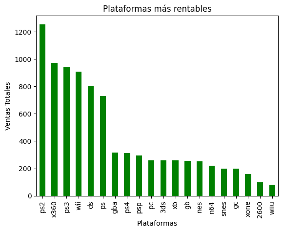
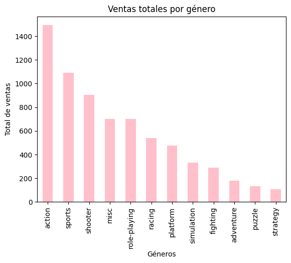
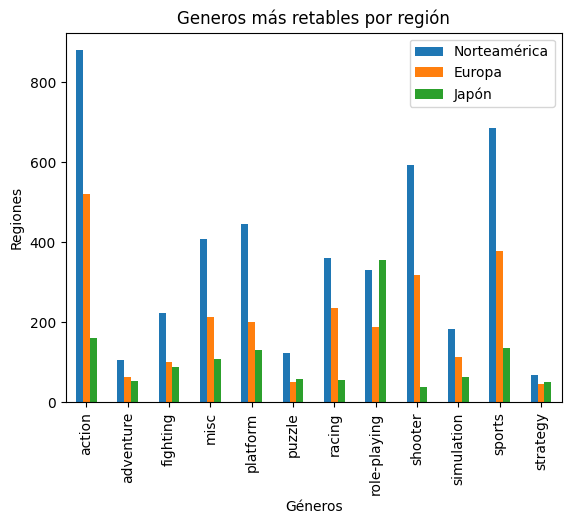
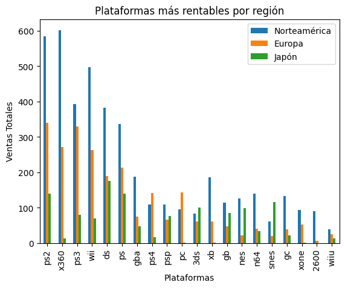

# Análisis de Patrones de Éxito en Videojuegos para la Tienda Online Ice

El objetivo principal de este proyecto fue identificar patrones y factores que permitan determinar si un videojuego tiene éxito o no dentro de la tienda online Ice. A través del análisis de datos históricos de ventas, plataformas, géneros y calificaciones de usuarios y críticos, se buscó obtener información valiosa que facilite la toma de decisiones estratégicas relacionadas con la comercialización y promoción de videojuegos.

### Limpieza y preparación de los datos
1. Se detectaron inconsistencias en los nombres de las columnas, incluyendo mayúsculas, espacios y formatos poco uniformes.
Solución: se estandarizaron los nombres utilizando minúsculas y formatos más legibles para facilitar el análisis.
2. El conjunto de datos contenía valores faltantes en algunas columnas importantes.
Solución: dependiendo del caso, los valores ausentes fueron reemplazados, eliminados o tratados cuidadosamente para evitar afectar el análisis.
3. Algunas columnas numéricas y de fechas estaban almacenadas como texto.
Solución: se corrigieron los tipos de datos para garantizar cálculos y visualizaciones precisas.

### Análisis exploratorio de datos
1. Se observó que los años con mayor cantidad de lanzamientos de videojuegos fueron: 2008 y 2009. Esto indica un período de alta producción y crecimiento dentro de la industria de los videojuegos.
2. Durante el análisis histórico de ventas y lanzamientos se identificaron los períodos de mayor popularidad de distintas plataformas:
  * PS2: auge entre 2001 y 2003, con un pequeño declive en 2002.
  * DS: auge entre 2005 y 2008, aunque presentó una disminución temporal en 2006.
  * PS3: auge en 2012.
  * WII: auge en 2009.
  * X360: auge en 2010.
Además, se determinó que la vida promedio de una plataforma es de aproximadamente 16 años.

3. Se realizaron gráficas comparativas para identificar las plataformas más rentables del mercado actual.

Los resultados muestran que PS4 es actualmente una de las plataformas más rentables del mercado.

4. Los géneron más rentables del mercado:
   

6. También se analizaron los géneros por región y las plataformas más rentables por región:

7. Ventas por regiones:

## Recomendaciones:

Se recomienda priorizar inversiones en los géneros de action, sports y sooter; ya que queda demostrado que son los géneros de juego con mayor rentabilidad en el mercado. 
